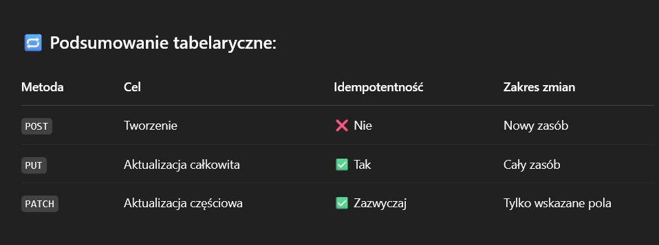

# NOTES

- Error page declared in react router, it has useRouteError, so we can check if error status is for example 404 or other type
- We can make layouts like HomeLayout or Dashboard Layout, need to declare children and inside children element with no path, but index true
- in react router paths are just added to each other, so if we have parent "/" and children "about" it will be merged to /about
- The trick with index.js in folder allows to group imports inside folder, something like sub module but just imports
- The cool website with images in the graphic folder
- Icons from react icons
- To NavLik (it adds active class to css) we need to add end parameter to match only end or URL
- To make dark theme set global class dark-theme on body element and save it in local storage, this class changes css variables from light to dark theme only in css

## Server

- To set ES Modules on backend need to set type module in package json
- Morgan package to add logs to server
- Dotenv package to use env variables
- In node we can use fetch and global (not in function) await syntax not need to wrap in async function, also we have node --watch don't need to use nodemon
- Controller is a function to handle endpoint request
- Router is a element that groups related controllers, under common endpoint
- Authentication = "Who are you?" - login form
- Authorization = "What are you allowed to do?" roles, access
- Validation layer - before we get to controller we know that id is correct, data are correct, job with id exists in database
- First user will be admin login in register controller
- On local we run app on 2 different server client / server so need to configure proxy, to pass CORS check, proxy work that every request on path /api will be redirect to server url
  - CORS (Cross-Origin Resource Sharing) - It's a security feature implemented by browsers to control whether a webpage from one origin can make requests to a different origin. It is handled by Access-Control-Allow-Origin
- A JWT is a compact, URL-safe way to represent claims between two parties — typically used for authentication and authorization. HEADER.PAYLOAD.SIGNATURE in base64

It's a self-contained token that stores information like user ID, roles, and expiration — and it's digitally signed, so it can be verified and trusted.

- Use concurrently to build server and client together
- Use axios on local with custom axios configuration base url
  

- Metoda HEAD - pobiera tylko nagłówki bez ciała odpowiedzi body
- Metoda OPTIONS - zwraca dostępne metody dla danego zasobu
- Hashing alghoritms use bcrypt, argon 2, PBKDF2, they take longer to compute so protect against brute force attacks, use seed, so its hard to reverse it, dont use md5, sha 256 512, they dont use seed and have fast computing easy to crack.
  -Authentication Methods:

1. Session-Based Authentication

   ✅ Classic & reliable

   Server creates a session when user logs in.

   A session ID is stored in a secure, HttpOnly cookie.

   On every request, the cookie is sent; server looks up the session.

   2. OAuth 2.0

   🌍 Standard for delegating auth

   Used when authenticating via 3rd parties (Google, Facebook, GitHub)

   You don’t handle credentials — the provider does

   You get an access token to access APIs on the user's behalf

   OAuth 2.0 is a framework for delegated authorization.

Instead of asking users to give you their username and password, you ask a trusted provider (like Google or GitHub) to verify them and give you access to limited resources on their behalf.

But base on token

2. API Key Authentication

   Simple token (string) added to request headers

   Common for server-to-server or 3rd-party integrations

Authorization: ApiKey YOUR_KEY_HERE

Cons:

    No user context

    No fine-grained control

    Doesn’t expire unless revoked manually

TODO:

- I will add authorization layer for all routes not only one to keep it clear
- Move authorization to separate layer not in validateIdParam
- This application is made in model view controller architecture
- Maybe try this functional based DDD

What Is Feature-Based Functional DDD?

    It means organizing your app by features/domains (e.g., user, task, order) and implementing logic using pure functions, instead of classes or layered (MVC-style) architecture.

Rather than separating your app into folders like controllers/, models/, routes/, etc., you group everything related to a specific domain together, and structure it using functional composition.

Opisane na chat GPT można spróbować u nas sesnownie podzielić na
Job i User model to domena i użyć warstwowych pure functions

### REACT ROUTER ACTIONS

- needs to return value always, it can be anything
- learn about JS API form data to handle form data in actions
- in action we use only redirect

-react toastify for toasts

- useActionData in readme approach to get errors inside form component - important!!! exapmle in login

- loaders allows to prefetch some data, and render components only after data is fetched very cool

-outlets can take its own context and then use useOutletContextHook

-datę trzymamy na bazie w formacie iso a na froncie można użyć biblioteki np dayjs

-mongodb aggregators learn in readme

- pexels pexels.com for image avatars

- jeżeli mamy pliczek to wysyłamy go jako FormData bezpośrednio na serwer nie zamieniamy na json (nie przekształcamy na obiekt)

- multer do przechowywania plików z formularza

- stronka do mockowania danych https://www.mockaroo.com/

-sprawdzić https://jpuri.github.io/react-draft-wysiwyg/#/demo

- req query allows us to pass url query parameters
- pagination if we click on pagination it adds extra param to url if we set search params it clears pagination from url

- For better SEO consider creating infinite scroll
